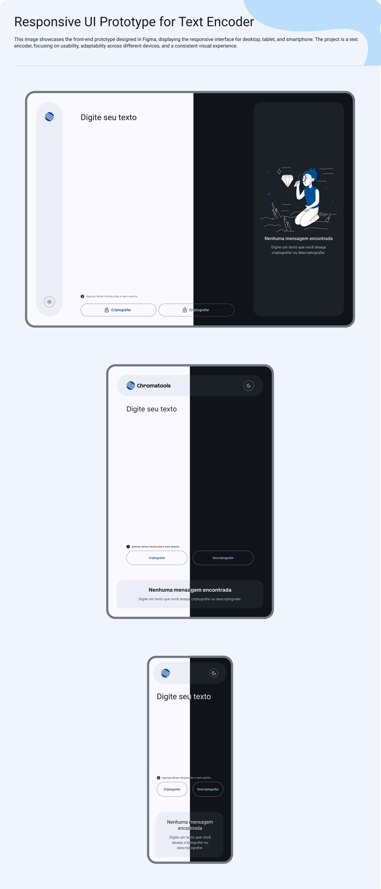

<a id="readme-top"></a>

[![Contributors][contributors-shield]][contributors-url]
[![Forks][forks-shield]][forks-url]
[![Stargazers][stars-shield]][stars-url]
[![Issues][issues-shield]][issues-url]
[![Apache License][license-shield]][license-url]
[![LinkedIn][linkedin-shield]][linkedin-url]

<br />

<div align="center">
  <h3 align="center">Text Decoder</h3>

  <p align="center">
    A modern text encoding/decoding web application with Material Design 3
    <br />
    <a href="https://github.com/Nic-Soares/text-decoder"><strong>Explore the docs »</strong></a>
    <br />
    <br />
    <a href="https://yourUsername.github.io/text-decoder">View Demo</a>
    ·
    <a href="https://github.com/Nic-Soares/text-decoder/issues">Report Bug</a>
    ·
    <a href="https://github.com/Nic-Soares/text-decoder/issues">Request Feature</a>
  </p>

</div>

<details>
  <summary>Table of Contents</summary>
  <ol>
    <li><a href="#about-the-project">About The Project</a></li>
    <li><a href="#features">Features</a></li>
    <li><a href="#built-with">Built With</a></li>
    <li>
      <a href="#getting-started">Getting Started</a>
      <ul>
        <li><a href="#prerequisites">Prerequisites</a></li>
        <li><a href="#installation">Installation</a></li>
      </ul>
    </li>
    <li><a href="#design">Design</a></li>
    <li><a href="#roadmap">Roadmap</a></li>
    <li><a href="#contributing">Contributing</a></li>
    <li><a href="#license">License</a></li>
    <li><a href="#contact">Contact</a></li>
    <li><a href="#acknowledgments">Acknowledgments</a></li>
  </ol>
</details>


## About The Project

This project, evolved from an Alura ONE challenge, has been reimagined as a professional-grade text processing tool. It maintains the core concept of text encoding/decoding while implementing modern web development practices and enhanced user experience.

## Features

- 🔒 Text encryption and decryption
- 🎨 Material Design 3 UI/UX
- 📱 Responsive design
- 🌓 Light/Dark mode support
- 📝 Modern TypeScript implementation

## Built With

* [![TypeScript][TypeScript]][TypeScript-url]
* [![Material Design][MaterialDesign]][MaterialDesign-url]
* [![CSS][CSS]][CSS-url]
* [![HTML5][HTML5]][HTML5-url]

## Getting Started

### Prerequisites

* npm

  ```sh
  npm install npm@latest -g
  ```

### Installation

1. Clone the repository

   ```sh
   git clone https://github.com/Nic-Soares/text-decoder.git
   ```

2. Install NPM packages

   ```sh
   npm install
   ```

3. Start development server

   ```sh
   npm run dev
   ```

## Design

The UI/UX was carefully crafted in Figma following Material Design 3 principles.
[View Figma Project](https://www.figma.com/design/hTqeS62v82SNdmRB9HdpVa/Web-Desing?node-id=428-2298&t=QKc55g8YmOgzb8i1-1)

### Theme Previews



## Roadmap

- [x] Complete UI redesign
- [x] TypeScript environment setup
- [x] Dark mode implementation
- [ ] JavaScript to TypeScript migration
- [ ] Additional text processing features

See the [open issues](https://github.com/Nic-Soares/text-decoder/issues) for a full list of proposed features and known issues.

## Contributing

Contributions are what make the open source community such an amazing place to learn, inspire, and create. Any contributions you make are **greatly appreciated**.

1. Fork the Project
2. Create your Feature Branch (`git checkout -b feature/AmazingFeature`)
3. Commit your Changes (`git commit -m 'Add some AmazingFeature'`)
4. Push to the Branch (`git push origin feature/AmazingFeature`)
5. Open a Pull Request

## License

Distributed under the Apache License 2.0. See `LICENSE` for more information.

## Contact

Nicolas - [@nicolas.png](https://pixelfed.social/i/web/profile/786535529506570345)

## Acknowledgments

* Originally inspired by Alura ONE challenge
* [Material Design Guidelines](https://m3.material.io/)
* [TypeScript Documentation](https://www.typescriptlang.org/)
* [SMACSS Methodology](http://smacss.com/)

<p align="right">(<a href="#readme-top">back to top</a>)</p>

<!-- MARKDOWN LINKS & IMAGES -->

[contributors-shield]: https://img.shields.io/github/contributors/Nic-Soares/text-decoder.svg?style=for-the-badge
[contributors-url]: https://github.com/Nic-Soares/text-decoder/graphs/contributors
[forks-shield]: https://img.shields.io/github/forks/Nic-Soares/text-decoder.svg?style=for-the-badge
[forks-url]: https://github.com/Nic-Soares/text-decoder/network/members
[stars-shield]: https://img.shields.io/github/stars/Nic-Soares/text-decoder.svg?style=for-the-badge
[stars-url]: https://github.com/Nic-Soares/text-decoder/stargazers
[issues-shield]: https://img.shields.io/github/issues/Nic-Soares/text-decoder.svg?style=for-the-badge
[issues-url]: https://github.com/Nic-Soares/text-decoder/issues
[license-shield]: https://img.shields.io/github/license/Nic-Soares/text-decoder.svg?style=for-the-badge
[license-url]: https://github.com/Nic-Soares/text-decoder/blob/main/LICENSE
[linkedin-shield]: https://img.shields.io/badge/-LinkedIn-black.svg?style=for-the-badge&logo=linkedin&colorB=555
[linkedin-url]: https://www.linkedin.com/in/nicolas-soares-797847121/

[TypeScript]: https://img.shields.io/badge/TypeScript-a?style=for-the-badge&logo=typescript&logoColor=%233178C6&logoSize=auto&labelColor=white&color=%233178C6
[TypeScript-url]: https://www.typescriptlang.org/
[MaterialDesign]: https://img.shields.io/badge/Material%20Desing-%23757575?style=for-the-badge&logo=materialdesign&logoColor=%23757575&logoSize=auto&labelColor=white&color=%23757575
[MaterialDesign-url]: https://m3.material.io/
[CSS]: https://img.shields.io/badge/CSS-CSS?style=for-the-badge&logo=css&logoColor=%23663399&logoSize=auto&labelColor=white&color=%23663399
[CSS-url]: https://img.shields.io/badge/CSS-CSS?style=for-the-badge&logo=css&logoColor=%23663399&logoSize=auto&labelColor=white&color=%23663399
[HTML5]: https://img.shields.io/badge/Material%20Desing-%23757575?style=for-the-badge&logo=html5&logoColor=%23E34F26&logoSize=auto&labelColor=white&color=%23E34F26
[HTML5-url]: https://img.shields.io/badge/Material%20Desing-%23757575?style=for-the-badge&logo=html5&logoColor=%23E34F26&logoSize=auto&labelColor=white&color=%23E34F26
